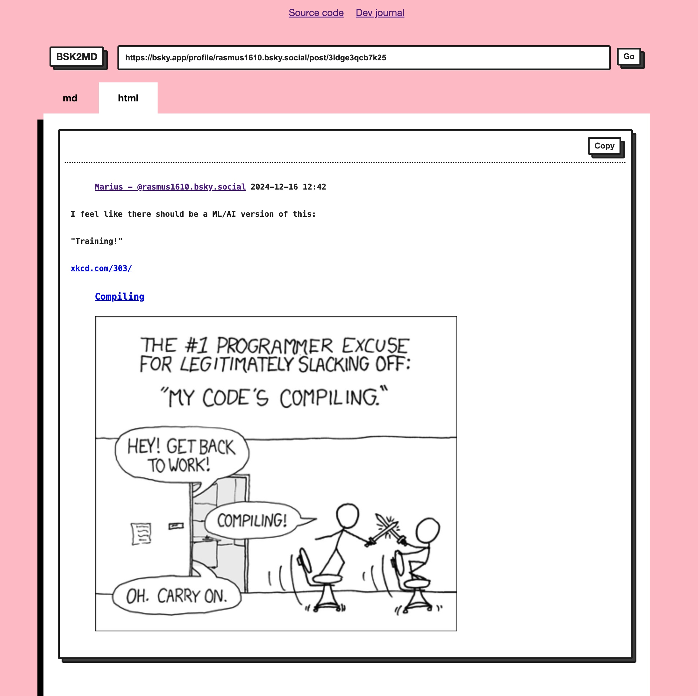

# 🦋 ➡️ 🤖 bsky2md

<div align="center">

**Convert Bluesky threads to markdown**

[Features](#-features) • [API](#-api) •
[Dev journal](https://bsky.app/profile/callmephilip.com/post/3ld26pvzddk2l)

</div>

## Features

- supported features: links, mentions
- supported embeds: images, external links
- markdown and HTML

## API

You can grab MD programmatically like this (example using typescript)

```ts
const r = await fetch(
  "https://bsky.app/profile/randomwalker.bsky.social/post/3lczsmzoqe22e"
    .replace("bsky.app", "bsky2md.deno.dev"),
);
console.log("MD:", await r.text());
```

---


